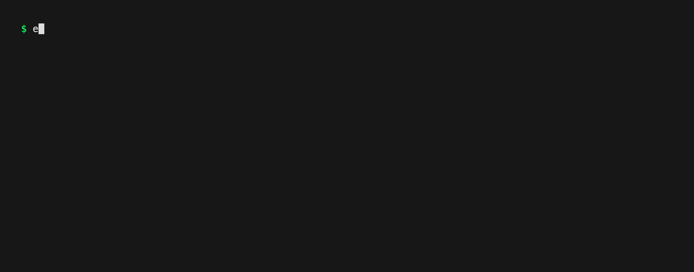

# example-go-cli

An example go CLI to demo and learn new Go tooling!

## Convert to a new project

- copy example-go-cli
- erase the git history
- commit
- replace all references to it with the new name
- update README
- Create repo on GitHub and push this to it
- update go.bbkane.com
- if a CLI: 
  - go install go.bbkane.com/cli@latest to test
  - add KEY_GITHUB_GORELEASER_TO_HOMEBREW_TAP to secrets
  - Push a tag to build
  - brew install bbkane/tap/cli
- Add feature
- update demo.gif

## Use



```bash
example-go-cli hello
```

## Install

- [Homebrew](https://brew.sh/): `brew install bbkane/tap/example-go-cli`
- [Scoop](https://scoop.sh/):

```
scoop bucket add bbkane https://github.com/bbkane/scoop-bucket
scoop install bbkane/example-go-cli
```

- Download Mac/Linux/Windows executable: [GitHub releases](https://github.com/bbkane/example-go-cli/releases)
- Go: `go install go.bbkane.com/example-go-cli@latest`
- Build with [goreleaser](https://goreleaser.com/) after cloning: `goreleaser --snapshot --skip-publish --clean`

## Notes

See [Go Developer Tooling](https://www.bbkane.com/blog/go-developer-tooling/) for notes on development tooling.
