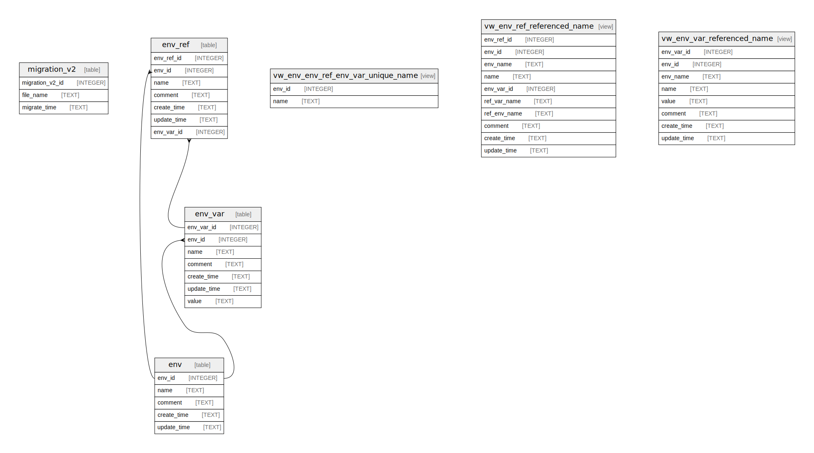

# Envelope Database Schema

## Tables

| Name | Columns | Comment | Type |
| ---- | ------- | ------- | ---- |
| [migration_v2](migration_v2.md) | 3 |  | table |
| [env](env.md) | 5 |  | table |
| [var](var.md) | 7 |  | table |
| [var_ref](var_ref.md) | 7 |  | table |
| [vw_env_var_var_ref_unique_name](vw_env_var_var_ref_unique_name.md) | 2 |  | view |
| [vw_var_expanded](vw_var_expanded.md) | 8 |  | view |
| [vw_var_ref_expanded](vw_var_ref_expanded.md) | 10 |  | view |

## Relations

---

> Generated by [tbls](https://github.com/k1LoW/tbls)
