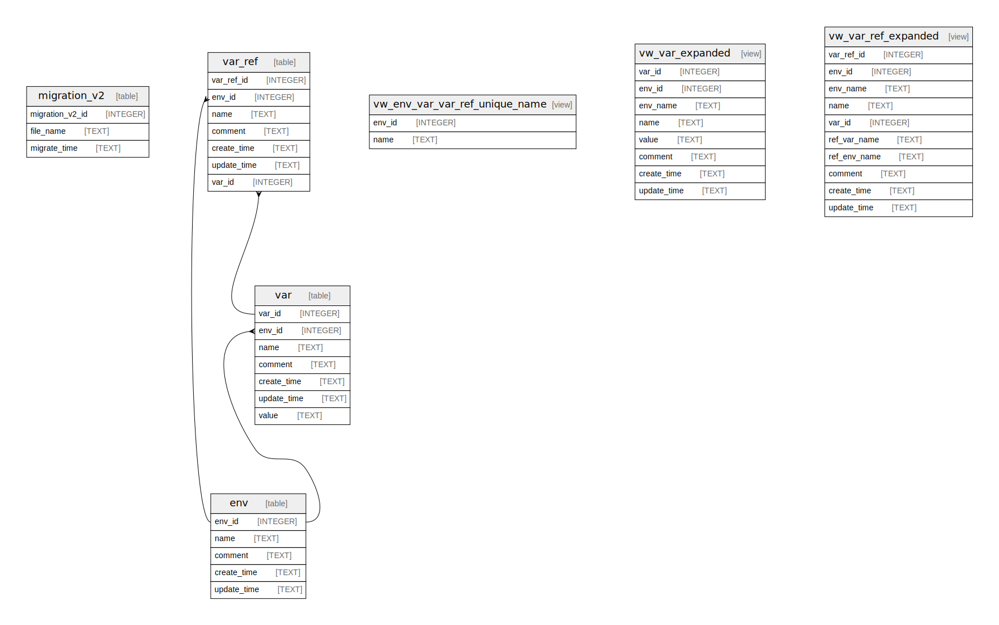

# Envelope Database Schema

## Tables

| Name | Columns | Comment | Type |
| ---- | ------- | ------- | ---- |
| [migration_v2](migration_v2.md) | 3 |  | table |
| [env](env.md) | 5 |  | table |
| [env_var](env_var.md) | 7 |  | table |
| [env_ref](env_ref.md) | 7 |  | table |
| [vw_env_env_ref_env_var_unique_name](vw_env_env_ref_env_var_unique_name.md) | 2 |  | view |
| [vw_env_ref_referenced_name](vw_env_ref_referenced_name.md) | 10 |  | view |
| [vw_env_var_referenced_name](vw_env_var_referenced_name.md) | 8 |  | view |

## Relations

---

> Generated by [tbls](https://github.com/k1LoW/tbls)
