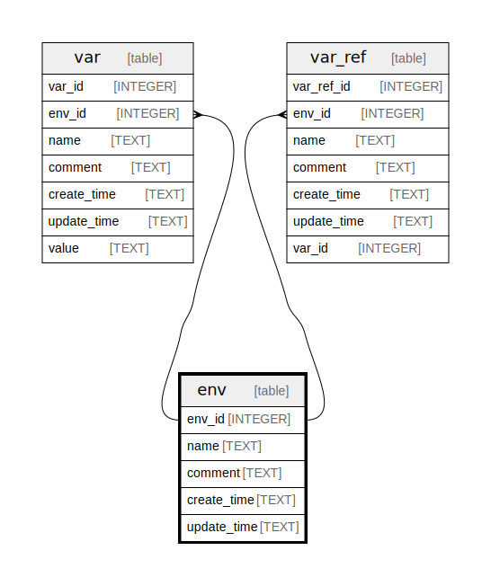

# env

## Description

<details>
<summary><strong>Table Definition</strong></summary>

```sql
CREATE TABLE env (
    env_id INTEGER PRIMARY KEY,
    name TEXT NOT NULL,
    comment TEXT NOT NULL,
    create_time TEXT NOT NULL,
    update_time TEXT NOT NULL,
    UNIQUE(name)
) STRICT
```

</details>

## Columns

| Name | Type | Default | Nullable | Children | Parents | Comment |
| ---- | ---- | ------- | -------- | -------- | ------- | ------- |
| env_id | INTEGER |  | true | [env_var](env_var.md) [env_ref](env_ref.md) |  |  |
| name | TEXT |  | false |  |  |  |
| comment | TEXT |  | false |  |  |  |
| create_time | TEXT |  | false |  |  |  |
| update_time | TEXT |  | false |  |  |  |

## Constraints

| Name | Type | Definition |
| ---- | ---- | ---------- |
| env_id | PRIMARY KEY | PRIMARY KEY (env_id) |
| sqlite_autoindex_env_1 | UNIQUE | UNIQUE (name) |

## Indexes

| Name | Definition |
| ---- | ---------- |
| sqlite_autoindex_env_1 | UNIQUE (name) |

## Relations



---

> Generated by [tbls](https://github.com/k1LoW/tbls)
