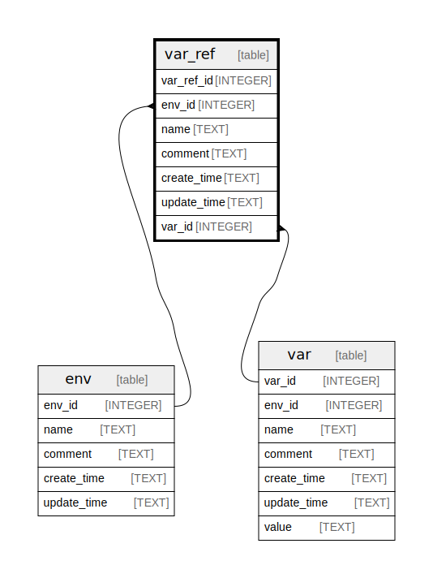

# var_ref

## Description

<details>
<summary><strong>Table Definition</strong></summary>

```sql
CREATE TABLE "var_ref" (
    var_ref_id INTEGER PRIMARY KEY,
    env_id INTEGER NOT NULL,
    name TEXT NOT NULL,
    comment TEXT NOT NULL,
    create_time TEXT NOT NULL,
    update_time TEXT NOT NULL,
    var_id INTEGER NOT NULL,
    FOREIGN KEY (env_id) REFERENCES env(env_id) ON DELETE CASCADE,
    FOREIGN KEY (var_id) REFERENCES "var"(var_id) ON DELETE RESTRICT,
    UNIQUE(env_id, name)
)
```

</details>

## Columns

| Name | Type | Default | Nullable | Children | Parents | Comment |
| ---- | ---- | ------- | -------- | -------- | ------- | ------- |
| var_ref_id | INTEGER |  | true |  |  |  |
| env_id | INTEGER |  | false |  | [env](env.md) |  |
| name | TEXT |  | false |  |  |  |
| comment | TEXT |  | false |  |  |  |
| create_time | TEXT |  | false |  |  |  |
| update_time | TEXT |  | false |  |  |  |
| var_id | INTEGER |  | false |  | [var](var.md) |  |

## Constraints

| Name | Type | Definition |
| ---- | ---- | ---------- |
| var_ref_id | PRIMARY KEY | PRIMARY KEY (var_ref_id) |
| - (Foreign key ID: 0) | FOREIGN KEY | FOREIGN KEY (var_id) REFERENCES var (var_id) ON UPDATE NO ACTION ON DELETE RESTRICT MATCH NONE |
| - (Foreign key ID: 1) | FOREIGN KEY | FOREIGN KEY (env_id) REFERENCES env (env_id) ON UPDATE NO ACTION ON DELETE CASCADE MATCH NONE |
| sqlite_autoindex_var_ref_1 | UNIQUE | UNIQUE (env_id, name) |

## Indexes

| Name | Definition |
| ---- | ---------- |
| ix_var_ref_var_id | CREATE INDEX ix_var_ref_var_id ON var_ref(var_id) |
| ix_var_ref_env_id | CREATE INDEX ix_var_ref_env_id ON var_ref(env_id) |
| sqlite_autoindex_var_ref_1 | UNIQUE (env_id, name) |

## Triggers

| Name | Definition |
| ---- | ---------- |
| tr_var_ref_insert_check_unique_name | CREATE TRIGGER tr_var_ref_insert_check_unique_name<br>BEFORE INSERT ON var_ref<br>FOR EACH ROW<br>BEGIN<br>    SELECT RAISE(FAIL, 'name already exists in env')<br>    FROM<br>    vw_env_var_var_ref_unique_name<br>    WHERE env_id = NEW.env_id AND name = NEW.name;<br>END |
| tr_var_ref_update_check_unique_name | CREATE TRIGGER tr_var_ref_update_check_unique_name<br>BEFORE UPDATE ON var_ref<br>FOR EACH ROW<br>BEGIN<br>    SELECT<br>        CASE<br>            WHEN OLD.env_id != NEW.env_id OR OLD.name != NEW.name THEN (<br>                SELECT RAISE(FAIL, 'name already exists in env')<br>                FROM vw_env_var_var_ref_unique_name<br>                WHERE env_id = NEW.env_id AND name = NEW.name<br>            )<br>            END;<br>        END |

## Relations



---

> Generated by [tbls](https://github.com/k1LoW/tbls)
