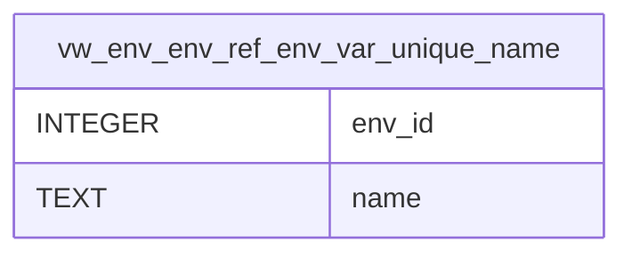

# vw_env_env_ref_env_var_unique_name

## Description

<details>
<summary><strong>Table Definition</strong></summary>

```sql
CREATE VIEW vw_env_env_ref_env_var_unique_name AS
SELECT e.env_id, er.name
FROM env e JOIN env_ref er ON e.env_id = er.env_id
UNION ALL
SELECT e.env_id, ev.name
FROM env e JOIN env_var ev ON e.env_id = ev.env_id
```

</details>

## Columns

| Name | Type | Default | Nullable | Children | Parents | Comment |
| ---- | ---- | ------- | -------- | -------- | ------- | ------- |
| env_id | INTEGER |  | true |  |  |  |
| name | TEXT |  | true |  |  |  |

## Referenced Tables

| Name | Columns | Comment | Type |
| ---- | ------- | ------- | ---- |
| [env](env.md) | 5 |  | table |
| [env_ref](env_ref.md) | 7 |  | table |
| [env_var](env_var.md) | 7 |  | table |

## Relations



---

> Generated by [tbls](https://github.com/k1LoW/tbls)
