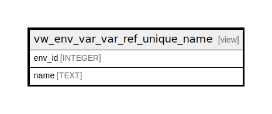

# vw_env_var_var_ref_unique_name

## Description

<details>
<summary><strong>Table Definition</strong></summary>

```sql
CREATE VIEW vw_env_var_var_ref_unique_name AS
SELECT e.env_id, vr.name
FROM env e JOIN var_ref vr ON e.env_id = vr.env_id
UNION ALL
SELECT e.env_id, v.name
FROM env e JOIN var v ON e.env_id = v.env_id
```

</details>

## Columns

| Name | Type | Default | Nullable | Children | Parents | Comment |
| ---- | ---- | ------- | -------- | -------- | ------- | ------- |
| env_id | INTEGER |  | true |  |  |  |
| name | TEXT |  | true |  |  |  |

## Referenced Tables

| Name | Columns | Comment | Type |
| ---- | ------- | ------- | ---- |
| [env](env.md) | 5 |  | table |
| [var_ref](var_ref.md) | 7 |  | table |
| [var](var.md) | 7 |  | table |

## Relations



---

> Generated by [tbls](https://github.com/k1LoW/tbls)
