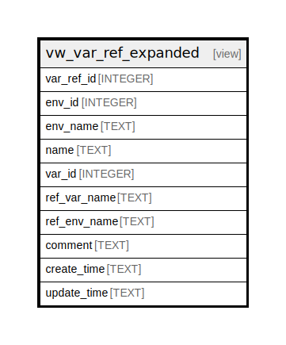

# vw_var_ref_expanded

## Description

<details>
<summary><strong>Table Definition</strong></summary>

```sql
CREATE VIEW vw_var_ref_expanded AS
SELECT
    var_ref_id,
    env_id,
    (SELECT name FROM env WHERE env_id = var_ref.env_id) AS env_name,
    name,
    var_id,
    (SELECT name FROM var WHERE var_id = var_ref.var_id) AS ref_var_name,
    (SELECT env.name FROM env JOIN var ON env.env_id = var.env_id WHERE var.var_id = var_ref.var_id) AS ref_env_name,
    comment,
    create_time,
    update_time
FROM var_ref
```

</details>

## Columns

| Name | Type | Default | Nullable | Children | Parents | Comment |
| ---- | ---- | ------- | -------- | -------- | ------- | ------- |
| var_ref_id | INTEGER |  | true |  |  |  |
| env_id | INTEGER |  | true |  |  |  |
| env_name | TEXT |  | true |  |  |  |
| name | TEXT |  | true |  |  |  |
| var_id | INTEGER |  | true |  |  |  |
| ref_var_name | TEXT |  | true |  |  |  |
| ref_env_name | TEXT |  | true |  |  |  |
| comment | TEXT |  | true |  |  |  |
| create_time | TEXT |  | true |  |  |  |
| update_time | TEXT |  | true |  |  |  |

## Referenced Tables

| Name | Columns | Comment | Type |
| ---- | ------- | ------- | ---- |
| [env](env.md) | 5 |  | table |
| [var](var.md) | 7 |  | table |
| [var_ref](var_ref.md) | 7 |  | table |

## Relations



---

> Generated by [tbls](https://github.com/k1LoW/tbls)
